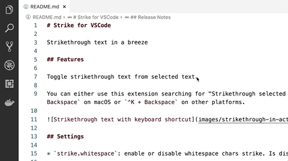

# Strike for VSCode

Strikethrough text in a breeze

## Features

Toggle strikethrough text from selected text.

You can either use this extension searching for "Strikethrough selected text" in Command Pallete or hitting `⌘K + S`.

## Release Notes

Users appreciate release notes as you update your extension.

### 1.0.0

Initial release of Strike
